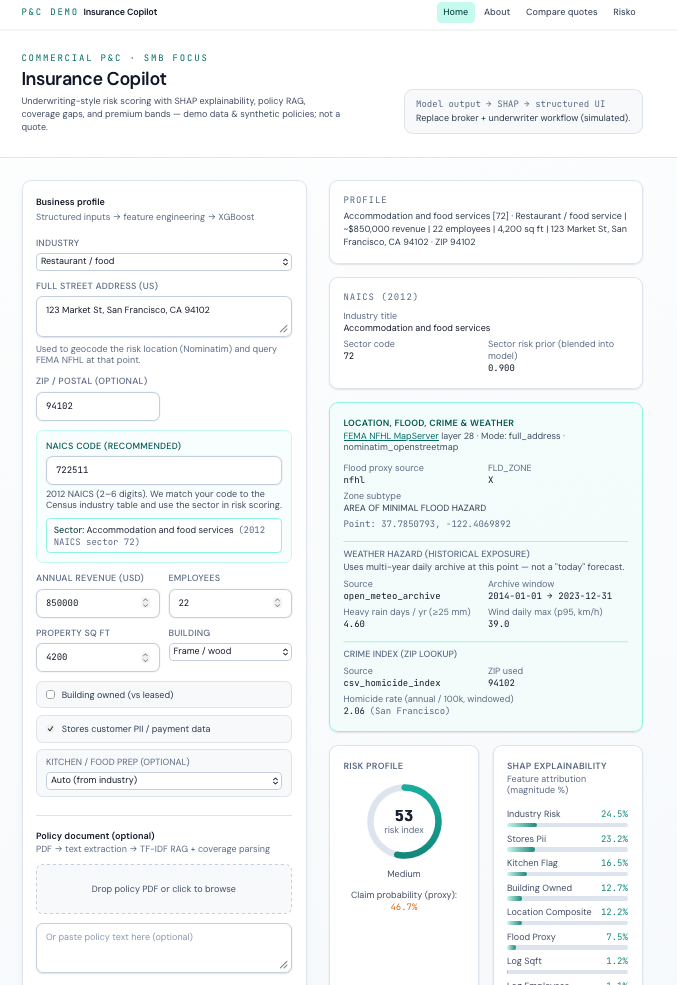
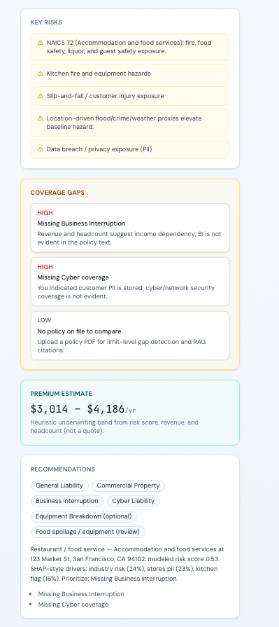
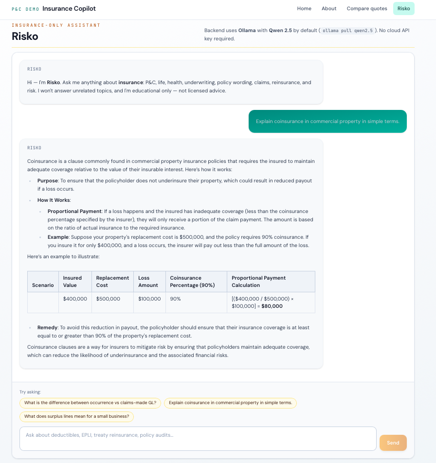
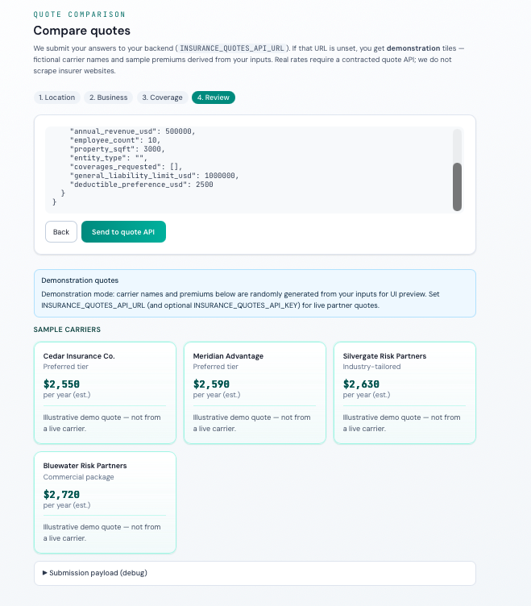

# Insurance Copilot

**Commercial P&amp;C–style demo** for SMB-focused workflows: structured business inputs, **XGBoost** risk scoring with **SHAP** explainability, **policy PDF** text extraction with **TF‑IDF RAG** and gap detection, an **insurance-only** chat assistant (**Risko**) via **Ollama**, and a **compare quotes** flow (partner API or local demo tiles).

> Educational / demonstration software — not licensed insurance advice or bindable rates.

---

## Screenshots

### Home — underwriting dashboard

Business profile inputs, enriched location context (FEMA NFHL, OSM, weather archive, crime proxy), and risk outputs with SHAP-style feature attribution.



### Home — key risks, gaps, premium band & recommendations

Industry and location-driven risks, **coverage gaps** vs extracted policy text, heuristic **premium band**, and prioritized actions.



### Risko — insurance-only assistant

Local **Ollama** + **Qwen 2.5** by default; Markdown answers with lists and tables. No cloud API key required for the default setup.



### Compare quotes

Multi-step wizard; without `INSURANCE_QUOTES_API_URL`, **demonstration** carrier tiles with illustrative premiums.



---

## Stack

| Layer | Technology |
|--------|------------|
| **API** | [FastAPI](https://fastapi.tiangolo.com/) (Python) |
| **ML** | XGBoost, SHAP, scikit-learn |
| **Policy text** | pypdf, TF‑IDF RAG + rule-based extraction |
| **UI** | React, Vite, Tailwind CSS |
| **Chat LLM** | Ollama (default) or OpenAI-compatible API |

---

## Quick start

**Backend** (from `backend/`):

```bash
python3 -m venv .venv
source .venv/bin/activate   # Windows: .venv\Scripts\activate
pip install -r requirements.txt
uvicorn app.main:app --reload --host 127.0.0.1 --port 8000
```

**Frontend** (from `frontend/`):

```bash
npm install
npm run dev
```

Open the app at `http://127.0.0.1:5173` (Vite proxies `/api` to port **8000**).

**Risko (optional):** install [Ollama](https://ollama.com), run `ollama pull qwen2.5`, keep Ollama running.

---

## Environment (high level)

| Variable | Purpose |
|----------|---------|
| `INSURANCE_QUOTES_API_URL` | Partner quote HTTPS endpoint (optional; demo tiles if unset) |
| `CORS_ORIGINS` | Extra allowed browser origins (comma-separated) |
| `OLLAMA_MODEL` | Default `qwen2.5` |
| `RISKO_LLM_BACKEND` | `ollama` (default) or `openai` + `OPENAI_API_KEY` |

See the in-app **About** page for the full list.

---

## Deploy the frontend on GitHub Pages

[GitHub Pages](https://pages.github.com/) only hosts **static files**. This repo includes a workflow that builds the **Vite** app and publishes `frontend/dist`.

### One-time setup (required)

If you skip this, the **Deploy** job fails with **HTTP 404** (`Failed to create deployment`).

1. Open **[Settings → Pages](https://github.com/hemanthsai126/Insurance-Copilot/settings/pages)** for this repository.
2. Under **Build and deployment**, set **Source** to **GitHub Actions** (not “Deploy from a branch”).
3. Save. Then push to `main` or run the workflow manually (**Actions → Deploy frontend to GitHub Pages → Run workflow**).

After a successful run, the site is at:

`https://<your-username>.github.io/<repo-name>/`  
(e.g. `https://hemanthsai126.github.io/Insurance-Copilot/`).

**Backend:** The FastAPI API does **not** run on GitHub Pages. For the live site to call your API:

- Deploy the backend somewhere that exposes HTTPS (VPS, Railway, Render, etc.).
- Add a [repository secret](https://docs.github.com/en/actions/security-guides/using-secrets-in-github-actions) named **`VITE_API_BASE_URL`** with your API **origin only** (no trailing `/api`), e.g. `https://your-api.example.com`.  
  The build injects it so the browser calls `https://your-api.example.com/api/...`.
- On the backend, set **`CORS_ORIGINS`** to your GitHub Pages URL, e.g.  
  `https://hemanthsai126.github.io` (or the exact Pages URL including path if needed).

If **`VITE_API_BASE_URL`** is unset, the Pages build still works, but **API requests from the browser will fail** until you add the secret and redeploy (or browse the app locally with `npm run dev`).

### Custom domain (e.g. `app.yourdomain.com`)

GitHub will prompt you to configure DNS — that’s expected.

1. **Repo → Settings → Pages → Custom domain** — enter your domain (e.g. `app.example.com` or `www.example.com`).
2. At your **DNS host** (where you bought the domain), add the records GitHub shows. Typical patterns:
   - **Subdomain** (`app` or `www`): **CNAME** → `hemanthsai126.github.io` (or the host GitHub displays).
   - **Apex** (`example.com`): **A** records to GitHub’s IPs (listed in [GitHub docs](https://docs.github.com/en/pages/configuring-a-custom-domain-for-your-github-pages-site/managing-a-custom-domain-for-your-github-pages-site)).
3. Wait for DNS (often minutes, sometimes up to 24h). Check **Enforce HTTPS** after validation.
4. **Important for this Vite app:** A custom domain is served at the **root** (`https://app.example.com/`), not under `/Insurance-Copilot/`. Set a [repository Actions variable](https://docs.github.com/en/actions/learn-github-actions/variables#creating-configuration-variables-for-a-repository) named **`VITE_BASE`** to **`/`** (just a slash), then re-run the deploy workflow. If you skip this, assets load from the wrong path and the site breaks.
5. Update backend **`CORS_ORIGINS`** to include your custom domain (e.g. `https://app.example.com`).

---

## Repository

[github.com/hemanthsai126/Insurance-Copilot](https://github.com/hemanthsai126/Insurance-Copilot)

---

## Disclaimer

This project is for **education and demos**. Model outputs, premium bands, and demo quotes are **not** binding insurance products. Use licensed professionals for coverage, claims, and compliance decisions in your jurisdiction.
